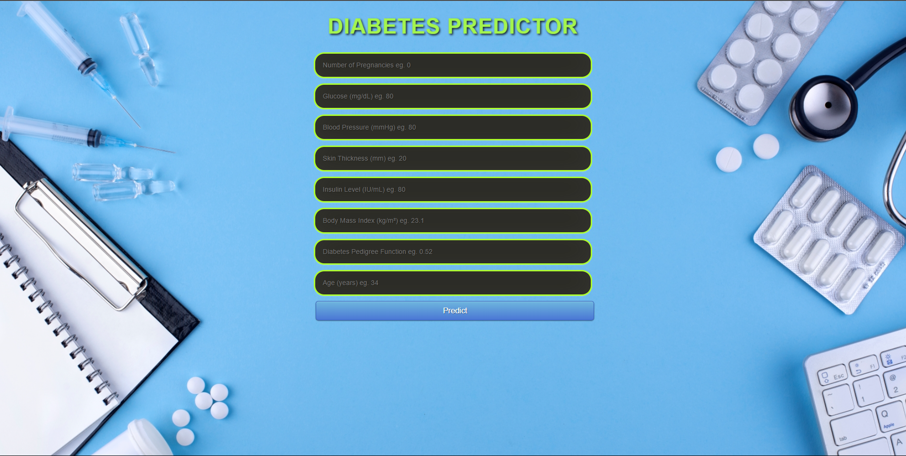
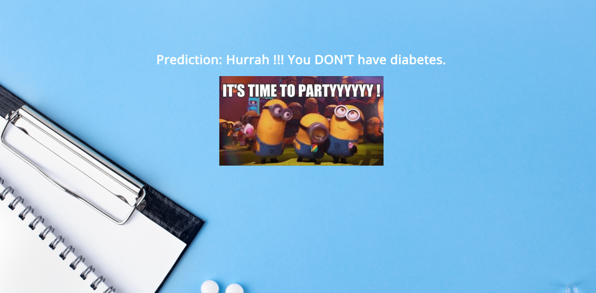

## Diabetes Prediction using Machine Learning.

### Table of Content

- [Overview](#overview)
- [Motivation](#motivation)
- [Demo](#demo)
- [Learning Objective](#Learning-Objective)
- [Technical Aspect](#technical-aspect)
- [Installation](#installation)
- [Run](#run)
- [License](#license)

### Overview

In this project, the objective is to predict whether the person has Diabetes or not based on various features like Number of Pregnancies, Insulin Level, Age, BMI.The data set that has used in this project has taken from the [kaggle](https://www.kaggle.com/) . "This dataset is originally from the National Institute of Diabetes and Digestive and Kidney Diseases. The objective of the dataset is to diagnostically predict whether or not a patient has diabetes, based on certain diagnostic measurements included in the dataset. Several constraints were placed on the selection of these instances from a larger database. In particular, all patients here are females at least 21 years old of Pima Indian heritage." and used a simple [random forest classifier](https://en.wikipedia.org/wiki/Random_forest).

### Motivation

Diabetes is an increasingly growing health issue due to our inactive lifestyle. If it is detected in time then through proper medical treatment, adverse effects can be prevented. To help in early detection, technology can be used very reliably and efficiently. Using machine learning we have built a predictive model that can predict whether the patient is diabetes positive or not."

## Screenshots

### Demo

### Learning Objective

The following points were the objective of the project (The main intention was to create an end-to-end ML project.)

- Data gathering
- Descriptive Analysis
- Data Visualizations
- Data Preprocessing
- Data Modelling
- Model Evaluation
- Model Deployment

### Technical Aspect

- Training a machine learning model using scikit-learn.
- Building and hosting a Flask web app on Heroku.
- A user has to put details like Number of Pregnancies, Insulin Level, Age, BMI etc .
- Once it get all the fields information , the prediction is displyed on a new page .

### Installation

- Clone this repository and unzip it.
- After downloading, cd into the flask directory.
- Begin a new virtual environment with Python 3 and activate it.
- Install the required packages using pip install -r requirements.txt

### Run

- Execute the command: python app.py

### LICENSE

-GNU GENERAL PUBLIC LICENSE Version 3
